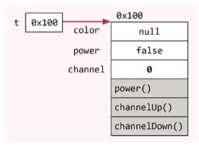

# CH6

### 객체지향 언어(OOP; Object Oriented Programming)

* 객체지향 언어 = 프로그래밍 언어 + 객체지향개념(규칙)

- 장점 : 코드 재사용성↑, 유지보수 용이, 중복코드 제거
- 핵심개념 : 캡슐화, 상속, 추상화, 다형성

### 클래스와 객체, 인스턴스

* 클래스(class) : 객체를 <span style="color:red">정의</span>해놓은 것으로 객체를  <span style="color:red">생성</span>하는데 사용

* 객체(object) : 실제로  <span style="color:red">존재</span>하는 것으로 객체가 지닌  <span style="color:red">기능, 속성</span>에 따라 용도가 다름

  ​                        모든 인스턴스를 대표하는 일반적 용어

  ​                        속성(변수)  + 기능(메서드)

  ```java
  class Tv{
      // 속성(변수)
      String color; //색깔
      boolean power; //전원상태
      int channel; //채널
      
      //기능(메서드)
      void power() { power = !power; }
      void channelUp() { channel++; }
      void channelDown() { channel--; }
  }
  ```

* 인스턴스 : 특정 클래스로부터 생성된 객체



### 객체 생성 및 사용

```java
// 클래스명 변수명;  -> 클래스의 객체를 참조하기 위한 참조변수를 선언
// 변수명 = new 클래스명(); -> 클래스의 객체를 생성 후, 객체의 주소를 참조변수에 저장

Tv t; // Tv클래스 타입의 참조변수 t를 선언
t = new Tv(); // Tv인스턴스를 생성한 후, 생성된 Tv인스턴스의 주소를 t에 저장

t.channel = 7; // Tv인스턴스의 멤버변수 channel의 값을 7로 한다.
t.channelDown(); // Tv인스턴스의 메서드 channelDown()을 호출한다.
System.out.println("현재 채널은 " + t.channel + " 입니다.")
```

```java
// 객체배열
Tv[] tvArr = new Tv[3];  //길이가 3인 Tv타입의 참조변수 배열

// 객체를 생성해서 배열의 각 요소에 저장
tvArr[0] = new Tv();
tvArr[1] = new Tv();
tvArr[2] = new Tv();

// 한번에 작성 가능
Tv[] tvArr = {new Tv(), new Tv(), new Tv()};
```

### 클래스 & 인스턴스 변수

```java
class Card{
    //인스턴스 변수(iv)
    String kind;  //무늬
    int number;  //숫자
    
    //클래스 변수(cv) -  static이 붙은 변수
    static int width = 100;  //폭
    static int height = 250; //높이
}
```

```java
Card c = new Card(); // 객체 생성

c.kind = "Heart";
c.number = 5;

//cv를 사용할 때는, 참조변수보다 클래스명으로 사용하는게 일반적이다.
c.width = 200;   ->  Card.width = 200;
c.height = 300   ->  Card.height = 300;
```

### 변수 초기화

* 지역변수(lv)는 수동 초기화를 해야함(사용전에 꼭!!!!)

* 멤버변수(iv, cv)는 자동 초기화된다.

* 멤버변수(iv, cv) 초기화 방법

  * 자동 초기화 : 0으로 초기화 됨
  * 명시적 초기화(=) : 대입 연산자를 사용한 초기화 방법

  ```java
  class Car{
      int door = 4; // 기본형 변수의 초기화
      Engine e = new Engine(); // 참조형 변수의 초기화; e는 Engine 객체의 주소를 가지고 있음
  }
  ```

  * 초기화 블럭
    * 인스턴스 초기화 블럭 :  생성자 사용
    * 클래스 초기화 블럭 : static {}

  * 생성자(iv 초기화)
    
  
  ```java
  class InitTest{
      static int cv = 1; // 명시적 초기화
      int iv = 1;        // 명시적 초기화
      
      static { cv = 2; } // 클래스 초기화 블럭
      { iv = 2 }         // 인스턴스 초기화 블럭
      
      InitTest(){  //  생성자
          iv = 3;
      }
  }
  
  //객체 생성
   InitTest it = new InitTest();  
  ```
  
  

### 메서드

* 문장을 묶어놓은 것 (선언부+구현부)
* <span style="color:red">클래스 내</span>에 존재해야함
* 값을 받아서 처리하고, 결과를 반환할 수 있음
* 반환할 것이 없을 때는 반환타입에  <span style="color:red">void</span>를 사용

##### 인스턴스 메소드

* 참조변수.메서드이름()으로 호출
* 인스턴스 멤버(iv, im)과 관련된 작업을 하는 메서드
* 메서드 내 인스턴스 변수(iv) 사용가능

##### Static 메소드

* 객체생성 없이 클래스이름.메서드이름()으로 호출
* 인스턴스 멤버(iv, im)과 관련없는 메서드
* 메서드 내에서 인스턴스 변수(iv) 사용 불가

```java
class MyMath2{
    long a, b; // 인스턴스 변수(iv)
    
    long add(){
        return a+b; // 인스턴스 변수 사용(iv 사용)
    }
    
    static add(long a, long b){  // 클래스 메서드(static메서드) a,b는 지역변수(lv)
        return a+b; // 지역변수 사용(lv 사용)
    }
}
```

  ```java
class MyMathTest2{
    public static void main(String args[]){
        System.out.println(MyMath2.add(200L, 200L)); // Static메서드 호출
        
        MyMath2 mm = new MyMath2(); //인스턴스 생성
        mm.a = 200L;
        mm.b = 100L;
        System.out.println(mm.add());  // 인스턴스메서드 호출
    }
}
  ```

* Static는 언제 사용? iv사용여부에 따라 Static, 인스턴드 메서드 선택하면 됨

* 인스턴스 변수는 객체 생성 후 사용가능

* 클래스 변수는 언제나 사용가능

* 인스턴스 메서드는 iv, cv, 인스턴스 메서드, Static메서드 모두 사용가능

* 클래스 메서드는 cv, Static메서드만 사용가능

### 오버로딩(Overloading)

* 한 클래스 안에 같은 이름의 메서드 여러개를 정의하는 것

##### 오버로딩이 성립하기 위한 조건

1. 메서드 이름이 같아야 한다.
2. 매개변수의 개수 또는 타입이 달라야 한다.
3. 반환 타입은 영향 없다.

```java
// 매개변수는 다르지만 같은 의미의 기능 수행
class MyMath3{
    int add(int a, int b){  
        System.out.print("int add(int a, int b) - ");
        return a+b;
    }
    long add(long a, long b){
        System.out.print("long add(long a, long b) - ");
        return a+b;
    }
    int add(int[] a){
        System.out.print("int add(int[] a) - ");
        int result = 0;
        for (int i=0; i<a.length; i++)
            result += a[i];
        return result;
   }
}
```

### 생성자(Constructor)

* 인스턴스가 생성될 때마다 호출되는 '인스턴스 초기화 메서드'

#### 생성자 작성시 지켜야할 조건

* 생성자의 이름이 클래스 이름과 같아야 한다.
* 리턴값이 없다.(void를 안붙임)
* 모든 클래스는 반드시 생성자 필수!

```java
class Data_1{
    int value;
}
class Data_2{  // 생성자 오버라이딩(메소드 이름을 같고 매개변수가 다름)
    Data_2() {}
    Data_2(int x){
        value = x;
    }
}
class Ex6_11{
    public static void main(String[] args){
        Data_1 d1 = new Data_1();  // 생성자가 없으니 자동으로 생성해줌
        Data_2 d2 = new Data_2();  
    }
}
```

### this()

#### 생성자 this()

* 생성자에서 다른 생성자 호출할 때 사용

```java
class Car2{
    String color;
    String gearType;
    int door;
    
    // 생성자 1번 
    Car2()  {
        this("white", "auto", 4); //Car2(String color, String gearType, int door)[생성자 3번] 호출
    }
    
    // 생성자 2번 
    Car2 (String color) {
        this(color, "auto", 4); //Car2(String color, String gearType, int door)[생성자 3번] 호출
    }
    
    // 생성자 3번
    Car2(String color, String gearType, int door) {  
        this.color = color;       // 참조변수 this
        this.gearType = gearType; // 참조변수 this
        this.door = door;         // 참조변수 this
    }
}
```

 #### 참조변수 this()

* 인스턴스 자신을 가리키는 참조변수
* 인스턴스 메서드(생성자 포함)에서 사용 가능
* 지역변수(lv)와 인스턴스 변수(iv)를 구별할 때 사용

```java
Car(String c, String g, int d){                        Car(String color, String gearType, int door){
    // color는 iv, c는 lv                                   // this.color는 iv, color는 lv 
   	color = c;                         --->                this.color = color;
    geatType = g;                                          this.gearType = gearType;
    door = d;                                              this.door = door;
}                                                       }
```


